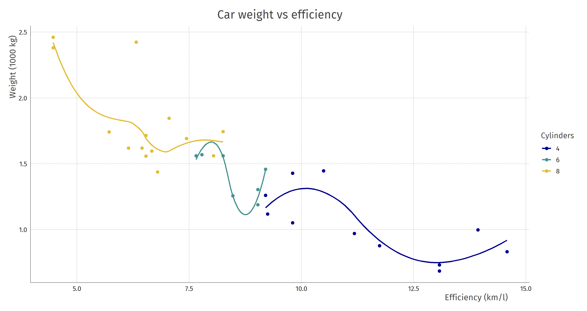
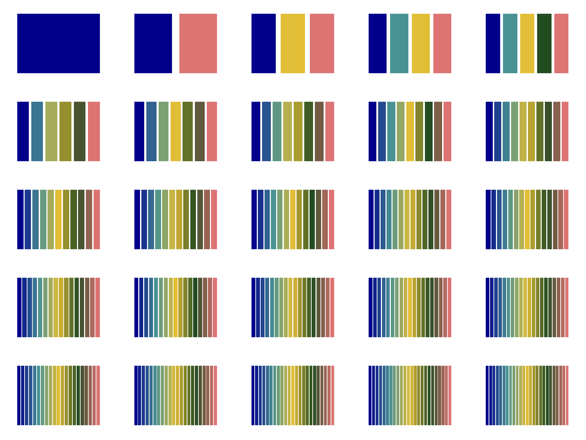

# firatheme

Work in progress

```R
ggplot(mtcars, aes(x = mpg*0.43, y = wt*0.4535924, colour = factor(cyl))) +
       geom_point(size = 2) + geom_smooth(se = FALSE) +
       labs(title = "Car weight vs efficiency",
            x = "Efficiency (km/l)",
            y = "Weight (1000 kg)") +
       theme_fira()

firaSave("plot.png", device = "png", dpi = 300)
```



`firaCols`


`firaPalette()`

