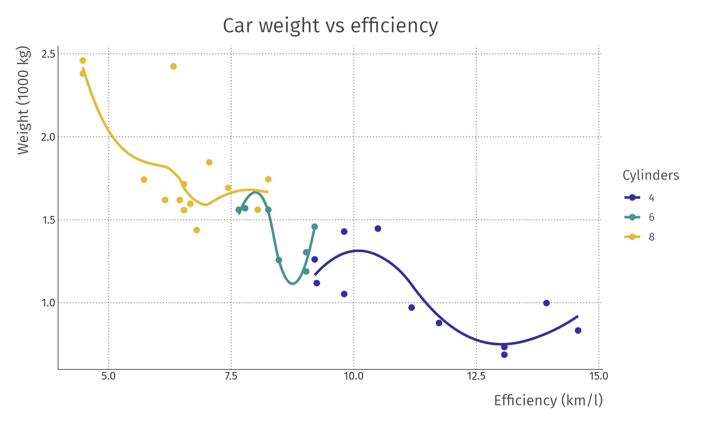
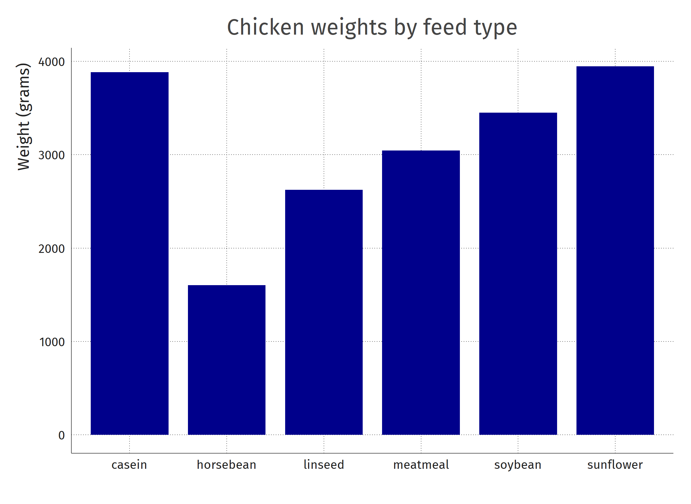
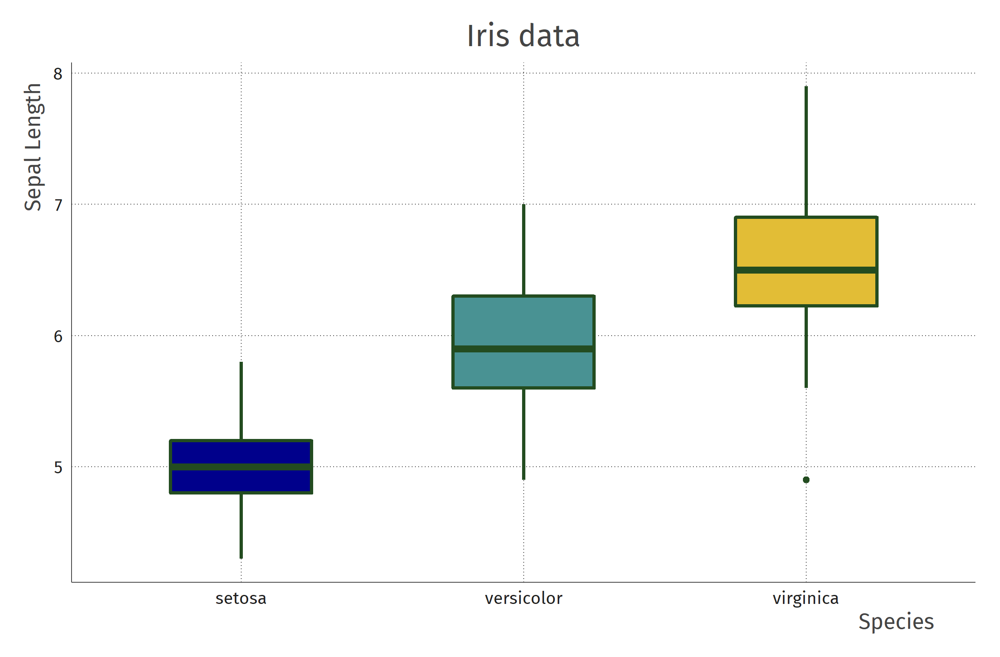
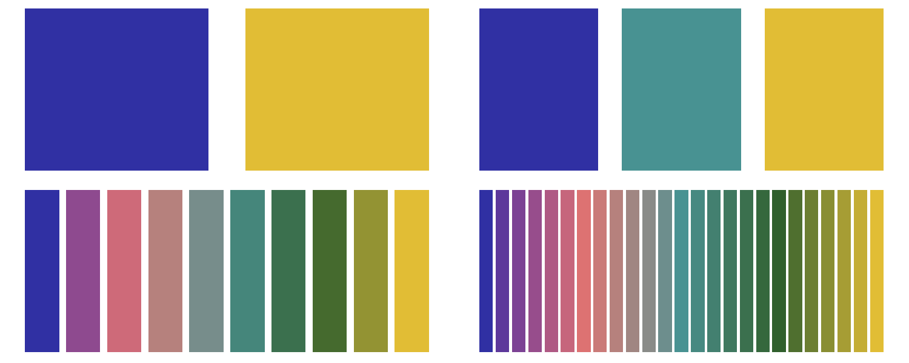

<p align="center"></img></p>
<h5 align="center">Ready-to-use <code>ggplot2</code> theme</h5>
<p align="center"><a href="https://zenodo.org/badge/latestdoi/125283144"></a></p>

<br>

This is a `ggplot2` theme I use for almost all my plots. You can use it and adapt it if you want. It's designed to be truly plug-and-play. See [below](#example-plots) for examples.

<p align="center">
  <br/>
  </img>
  <br/>
</p>


As with any software project, this has a collection of dependencies it builds on:

- The [trafford data lab theme](https://github.com/traffordDataLab/assets/blob/master/theme/ggplot2/theme_lab.R) was one of the main inspirations.
- It uses Mozilla's [Fira Sans](https://mozilla.github.io/Fira/) font because it is beautiful.
- Fonts in `R` graphics are notoriously difficult. The package [`extrafont`](https://github.com/wch/extrafont) solves this.
- Of course, one of the main dependencies is [`ggplot2`](https://github.com/tidyverse/ggplot2).
- I used [coolors](https://coolors.co/) to generate the colours.


## Installation
On mac computers, first install the [`Fira Sans`](https://fonts.google.com/specimen/Fira+Sans) font to the font book.


```R
remotes::install_github("vankesteren/firatheme")
```

The preferred way to save plots is via the `firaSave()` function. For png output, this works out of the box. 

### PDF output
For pdf output, `firaSave()` embeds the Fira Sans font by default using the `extrafont` package. The requirement for this is `ghostscript`:

#### On windows
1. Install [ghostscript](https://www.ghostscript.com/download/gsdnld.html).
2. Restart your `R` or `RStudio` application
3. Now you can output!

#### On mac
1. (install homebrew)
2. `brew install ghostscript`
3. Restart your `R` or `RStudio` application
4. Now you can output!

#### On linux
1. Install ghostscript so that it is on the `PATH`.
2. Restart your `R` or `RStudio` application
3. Now you can output!

## Example plots
Below you can find some example plots made using `theme_fira()`

### Dots and lines
```R
library(ggplot2)
library(firatheme)

ggplot(mtcars, aes(x = mpg*0.43, y = wt*0.4535924, colour = factor(cyl))) +
       geom_point(size = 2) + geom_smooth(se = FALSE) +
       labs(title = "Car weight vs efficiency",
            x = "Efficiency (km/l)",
            y = "Weight (1000 kg)",
            colour = "Cylinders") +
       theme_fira() +
       scale_colour_fira()

firaSave("plot.png", device = "png")
```


### Bar graph

```R
library(ggplot2)
library(firatheme)

ggplot(chickwts, aes(x = feed, y = weight)) +
  geom_bar(stat = "identity", width=0.8, fill = firaCols[1]) +
  labs(title = "Chicken weights by feed type",
       y = "Weight (grams)",
       x = "") +
  theme_fira()
```




### Boxplot

```R
library(ggplot2)
library(firatheme)

ggplot(iris, aes(y = Sepal.Length, x = Species, fill = Species)) +
  geom_boxplot(col = firaCols[4], width = 0.5, size = 1) +
  labs(y = "Sepal Length", title = "Iris data") +
  theme_fira() +
  scale_fill_fira() +
  theme(legend.position = "none")
```



### More lines
```R
library(ggplot2)
library(firatheme)

ggplot(airquality, aes(y = Ozone, x = 1:nrow(airquality))) +
  geom_line(colour = firaCols[2], size = 0.7) +
  geom_point(colour = firaCols[2], size = 1.7) +
  geom_smooth(colour = firaCols[1], size = 0.7, se = FALSE) +
  labs(title = "Ozone in New York", x = "Days") +
  theme_fira()
```


## Colours
The colour palette of `firatheme` is available through `firaCols` and `firaPalette()`. In `ggplot` objects, you should use `scale_fill_fira()` and `scale_colour_fira()` for mapped variables. Optionally, the argument `continuous = TRUE` can be passed.


Using the palette functions, you can get any number of colours from the palette, for example `firaPalette(n = 25)` --- the last image in the figure below:


## Citation
If you want to cite `firatheme`, you can use the following `bibtex`:

```bibtex
@article{vankesteren2021firatheme, 
  title = {vankesteren/firatheme: firatheme version 0.2.4}, 
  DOI = {10.5281/zenodo.4679413}, 
  publisher = {Zenodo}, 
  author = {Erik-Jan van Kesteren}, 
  year = {2021}, 
  month = {apr}
}
```
